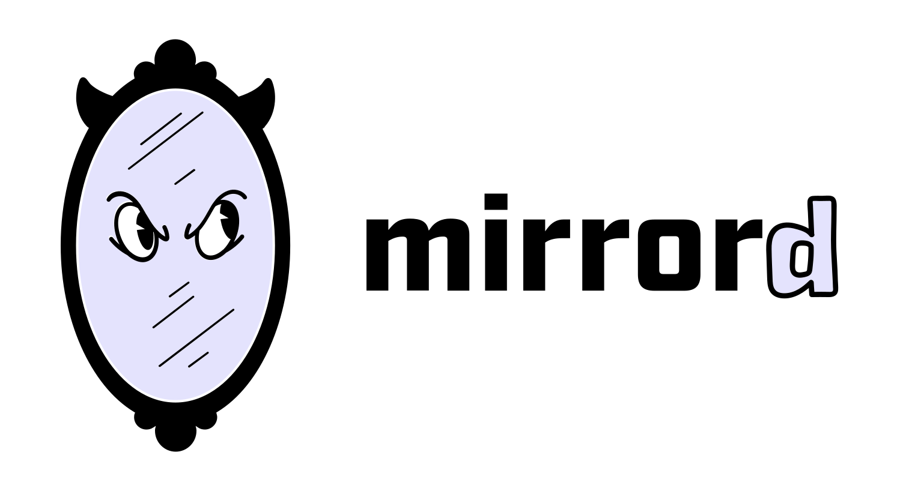

# Debugging Python Applications with mirrord

<div align="center">
  <a href="https://mirrord.dev">
    
  </a>
  <a href="https://python.org">
    
  </a>
</div>

## Overview

This is a sample web application built with Flask and Redis to demonstrate debugging Kubernetes applications using mirrord.

The application is a small note-taking app (`knote`) that stores entries in Redis and displays them on a web interface.

## Prerequisites

- Python 3.12+
- Docker and Docker Compose
- Kubernetes cluster
- mirrord CLI installed
- macOS or Linux (Windows users can use WSL2)

## Quick Start

1. Clone the repository:

```bash
git clone https://github.com/metalbear-co/mirrord-python-debug-example.git
cd mirrord-python-debug-example
```

2. Build the app image into minikube:

```bash
minikube image build -t mirrord-python-debug-example:0.1.0 .
```

3. Deploy to Kubernetes:

```bash
kubectl create -f ./kube
```

4. In a separate terminal, run with mirrord:

```bash
mirrord exec -f mirrord.json -- python app.py
```

The application will be available at `http://localhost:8080`.

## Architecture

The application consists of:

- Flask web server (`knote`)
- Redis instance for storing notes

## License

This project is licensed under the MIT License.
